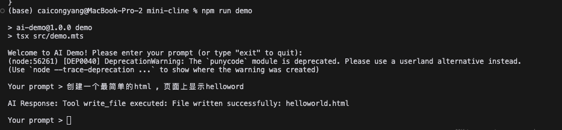

# AI Code Assistant CLI (Mini Cline)

[English](README.md) | [中文](README_zh.md)

A simplified implementation inspired by Cline (https://github.com/cline/cline), the autonomous coding agent. This mini version demonstrates the core concepts of AI-assisted coding through a command-line interface.

Inspiration
----------
This project is a tribute to Cline, the powerful VS Code extension that enables AI-assisted coding. While Cline offers a full-featured IDE integration with capabilities like browser automation and GUI interactions, this mini version focuses on demonstrating the basic concepts through a simple CLI interface.

Check out the original Cline project: https://github.com/cline/cline

Quick Demo
----------
Here's how it works:

In this example:
1. Run `npm run demo` to start the interactive mode
2. Type your request in natural language (e.g., "创建一个最简单的html，页面上显示helloword")
3. The AI will create the file for you (e.g., helloworld.html was created)
4. Type 'exit' to quit

It's that simple! Just tell the AI what you want to do in natural language.

Prerequisites
------------
• Node.js (v22)
• npm
• An API key for either Claude or DeepSeek

Quick Start
-----------
1. Install dependencies:
   $ npm install

2. Create .env file and add your API key:
   ANTHROPIC_API_KEY=your_claude_api_key_here
   # or
   DEEPSEEK_API_KEY=your_deepseek_api_key_here

3. Start using it:
   $ npm run demo

That's it! Now you can start talking to the AI assistant.

Usage Examples
-------------
1. Interactive Mode (Recommended for beginners):
   • Run: npm run demo
   • Type your request
   • See results
   • Type 'exit' to quit

2. Direct Command Mode:
   • Run: npm run demo -- "Create a simple JavaScript file that calculates fibonacci numbers"
   • See results immediately

3. Shell Script (Optional):
   • First time: chmod +x demo.sh
   • Then use: ./demo.sh "your request here"

Things You Can Ask
-----------------
• "Create a hello world HTML file"
• "Write a function to calculate prime numbers"
• "Explain how async/await works"
• "Create a React component for a todo list"

Project Structure
---------------
.
├── .env                # API keys
├── package.json       # Dependencies and scripts
├── tsconfig.json      # TypeScript config
├── demo.sh           # Shell script helper
└── src/
    └── demo.mts      # Main application code

Features
--------
• Interactive CLI mode
• Command-line argument support
• Basic file operations (read/write)
• Multiple AI provider support (Claude/DeepSeek)
• Natural language code generation
• Code explanation and modification

Key Differences from Cline
-------------------------
While the original Cline project offers:
• Full VS Code integration
• Browser automation
• GUI interactions
• Advanced file management
• Terminal integration
• MCP server support

This mini version focuses on:
• Basic CLI interface
• Simple file operations
• Core AI interactions
• Learning/demonstration purposes

License
-------
MIT

Note: This is an educational project inspired by Cline. For production use, please check out the original Cline project at https://github.com/cline/cline 