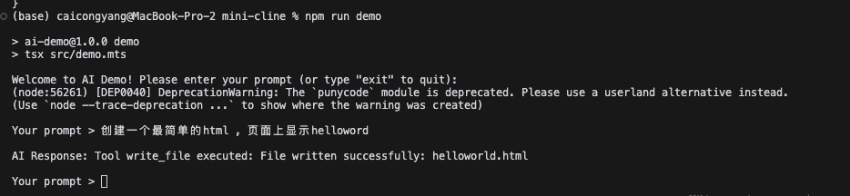

# AI 代码助手命令行工具 (Mini Cline)

[English](README.md) | [中文](README_zh.md)

这是一个受 Cline (https://github.com/cline/cline) 启发的简化实现版本。Cline 是一个自主编码代理工具，而这个迷你版本通过命令行界面展示了 AI 辅助编码的核心概念。

项目灵感
-------
本项目是对 Cline 这个强大的 VS Code 扩展的致敬。虽然 Cline 提供了完整的 IDE 集成功能，包括浏览器自动化和 GUI 交互等功能，但这个迷你版本专注于通过简单的命令行界面演示基本概念。

查看原始 Cline 项目：https://github.com/cline/cline

快速演示
-------
看看它是如何工作的：

在这个例子中：
1. 运行 `npm run demo` 启动交互模式
2. 用自然语言输入你的请求（例如："创建一个最简单的html，页面上显示helloword"）
3. AI 将为你创建文件（例如：创建了 helloworld.html）
4. 输入 'exit' 退出

就是这么简单！只需用自然语言告诉 AI 你想做什么。

环境要求
-------
• Node.js (v22)  
• npm  
• Claude 或 DeepSeek 的 API 密钥  

快速开始
-------
1. 安装依赖：
   $ npm install

2. 创建 .env 文件并添加你的 API 密钥：
   ANTHROPIC_API_KEY=你的_claude_api_密钥
   或者  
   DEEPSEEK_API_KEY=你的_deepseek_api_密钥

3. 开始使用：
   $ npm run demo

就这样！现在你可以开始和 AI 助手对话了。

使用示例
-------
1. 交互模式（推荐新手使用）：
   • 运行：npm run demo  
   • 输入你的请求  
   • 查看结果  
   • 输入 'exit' 退出  

2. 直接命令模式：
   • 运行：npm run demo -- "创建一个计算斐波那契数列的 JavaScript 文件"
   • 立即查看结果

3. Shell 脚本（可选）：
   • 首次使用：chmod +x demo.sh
   • 然后使用：./demo.sh "你的请求"

你可以问什么
----------
• "创建一个 hello world HTML 文件"  
• "写一个计算质数的函数"  
• "解释 async/await 是如何工作的"  
• "创建一个待办事项列表的 React 组件"  

项目结构
-------
.
├── .env                # API 密钥  
├── package.json       # 依赖和脚本  
├── tsconfig.json      # TypeScript 配置  
├── demo.sh           # Shell 脚本助手  
└── src/  
    └── demo.mts      # 主应用代码  

功能特性
-------
• 交互式命令行模式  
• 命令行参数支持  
• 基本文件操作（读/写）  
• 多 AI 提供商支持（Claude/DeepSeek）  
• 自然语言代码生成  
• 代码解释和修改  

与 Cline 的主要区别
----------------
原始 Cline 项目提供：
• 完整的 VS Code 集成
• 浏览器自动化
• GUI 交互
• 高级文件管理
• 终端集成
• MCP 服务器支持

而这个迷你版本专注于：
• 基本命令行界面
• 简单文件操作
• 核心 AI 交互
• 学习/演示目的

许可证
-----
MIT

注意：这是一个受 Cline 启发的教育项目。如果需要生产环境使用，请查看原始 Cline 项目：https://github.com/cline/cline 
